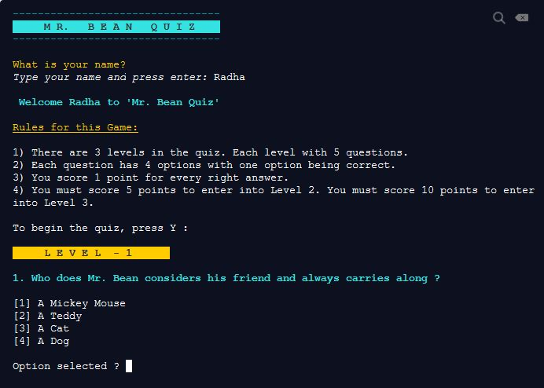

# 
**Mr.Bean QUIZ**

### Description
 
 'Mr. Bean Quiz ?' is a CLI quiz game based on the character Mr. Bean. If you are a Mr. Bean fan, then take this quiz and see if you can pass through all the 3 levels and appear in top three scorers.  

### Usage & Installation

There are 2 ways through which this CLI quiz app can be played.

1) Command Line

    This requires two node.js libraries to be installed.
    
    1. To install node.js library _'readline-sync'_:

        `npm install readline-sync`

    2. To install node.js library _'chalk'_:

        `npm install chalk`

2) Browser

    The CLI app can also be played in browser.

    To play quiz in browser :
    
    Click this  ->
    [Play quiz in browser](https://repl.it/@mansiGh/QUIZ-Mr-BEAN-Quiz#index.js?embed=1&output=1 "Do You Know Me QUIZ")  OR

    Visit link : https://repl.it/@mansiGh/QUIZ-Mr-BEAN-Quiz#index.js?embed=1&output=1

### Quiz game rules
1) There are 3 levels in the quiz. Each level with 5 questions.
2) Each question has 4 options with one option being correct.
3) You score 1 point for every right answer.
4) You must score 5 points to enter into Level 2. You must score 10 points to enter into Level 3.

### Scoreboard features
If the user appears in top three scorers, then user will have to send us a screenshot. We will update the scoreboard.

### Screenshot of quiz app

### Future scope
Make scoreboard updation dynamic.
